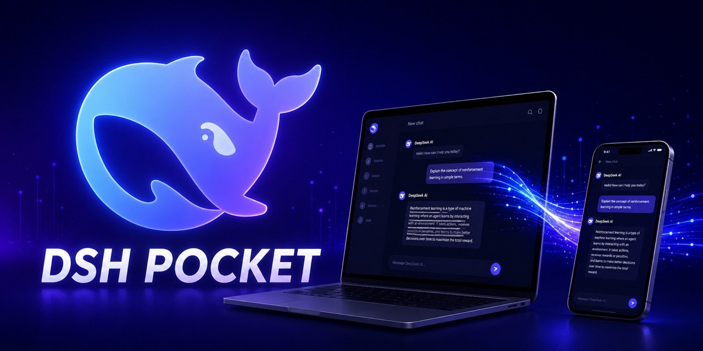

<p align="center">
  
</p>

<h1 align="center">wdx Pocket</h1>

<p align="center">
  把 <strong>DeepSeek Harness 装进口袋</strong>：一个包、一个设置页，手机扫二维码就实时看到电脑上的同一个界面——人在外面也能用。
</p>

> 基于 [dsh-pocket](https://github.com/shaobeichen/dsh-pocket)（GPL-2.0）二次开发，由 wdx 维护。

## ✨ 特性

| 特性 | 说明 |
|---|---|
| 📶 局域网扫码 | 装好即用：设置 → 插件 → 手机访问，打开就有局域网二维码，手机连同一 WiFi 扫码即开 |
| 🌐 公网多模式（v0.2+） | 快速隧道（trycloudflare，零配置）/ 命名隧道（自有域名走 Cloudflare）/ frp（自有服务器+域名），设置页一键切换 |
| ⚡ 实时同步 | 流式输出走 WebSocket 全透传——电脑上在输出，手机上同步在滚，可双向操作 |
| 📱 移动端适配 | 窄屏自动变抽屉布局（移植 dsh-web-mobile，MIT）：侧栏抽屉、会话全宽、状态栏安全区、触控优化 |
| 🧩 零依赖安装 | 一个 npm 包、一个设置页，没有核心/适配器要分开装；无需账号、无需服务器（frp 模式除外） |
| 🔒 URL 即钥匙 | 无公网 URL 暴露给第三方（局域网模式）；快速隧道每次重启自动换新 |

## 🚀 怎么用

**入口**：安装并重启 `dsh web` 后，打开 **设置**，左侧边栏可见 **「手机访问」** 入口。

**前提**：已装 [DeepSeek Harness](https://github.com/deepseek-ai/deepseek-harness)（`dsh --version` 可用）。

```sh
# 1. 装插件（发布到 npm 后：dsh plugin --profile web add wdx-pocket -w）
dsh plugin --profile web add <本仓库>/packages/pocket -w

# 2. 重启 dsh web
dsh web
```

### 局域网（同一 WiFi）

设置 → 插件 → **手机访问** → 手机扫「📶 局域网」二维码 → 打开的就是电脑上的 DSH，实时同步。

### 公网（人在外面）

设置页选择公网方式后点「开启公网访问」：

- **快速隧道**：默认，零配置，URL 为 `https://xxx.trycloudflare.com`（每次重启换新；国内网络可能无法直连）；
- **命名隧道**：自己的域名走 Cloudflare 隧道（如 `https://live.example.com`），自动探测 `~/.cloudflared` 凭据，只读引用、不改动你的原有配置；
- **frp**：自有公网服务器 + 自己的域名，国内访问最稳。

## ⚠️ 安全（必读）

- **DSH 能执行你电脑上的代码**。二维码/URL 就是钥匙，**请勿把二维码或 URL 发给任何人**
- 命名隧道/frp 模式 URL 固定，等于"钥匙不轮换"——请勿公开链接；后续版本会加访问令牌
- 局域网模式不暴露公网，只有同一网络内的设备能访问
- 适合个人自用；多设备/分享场景后续会加访问令牌

## 🛠 开发

```sh
pnpm install            # 在 monorepo 根执行
pnpm -r test            # 测试
node client/build.mjs   # 改 client/ 后重新打包（在 packages/pocket 内）
```

## 🤝 致谢

- 上游：[dsh-pocket](https://github.com/shaobeichen/dsh-pocket)（GPL-2.0）——本项目的功能与架构基础
- 移动端适配移植自 [mexiaosqwq/dsh-web-mobile](https://github.com/mexiaosqwq/dsh-web-mobile)（MIT）
- 公网隧道基于 [cloudflared](https://github.com/cloudflare/cloudflared)

## 📄 License

[GPL-2.0](LICENSE) —— 基于 dsh-pocket 二次开发，修改版同样以 GPL 开源并保留版权声明；
移动端适配部分版权声明保留在 `client/mobile/LICENSE.dsh-web-mobile`。
